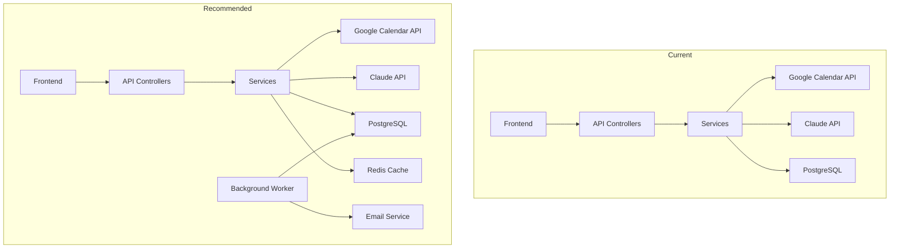

# AI Calendar Manager - Code Review & Feature Suggestions

**Review Date**: February 22, 2026  
**Reviewer**: Kilo Code (Architect Mode)  
**Project Status**: Production-Ready (95% Complete)

---

## Executive Summary

The AI Calendar Manager is a well-architected full-stack application demonstrating strong software engineering practices. The codebase shows mature patterns in OAuth implementation, AI integration with tool-calling, and API design. Below is a comprehensive code review with actionable recommendations and suggested next features.

---

## Code Review Findings

### 🟢 Strengths

#### 1. **Architecture & Design Patterns**
- **Clean Separation of Concerns**: Controllers → Services → Data Layer is well-organized
- **Dependency Injection**: Proper IoC container usage throughout
- **Interface-based Design**: All services have contracts (`IClaudeService`, `IGoogleCalendarService`, etc.)
- **Repository Pattern**: EF Core `AppDbContext` with proper entity configuration

#### 2. **Security Implementation**
- **PKCE OAuth Flow**: Correctly implemented in [`OAuthService.cs`](CalendarManager.API/Services/Implementations/OAuthService.cs:48-66)
- **Token Encryption**: AES-256-GCM with proper IV handling in [`TokenEncryptionService.cs`](CalendarManager.API/Services/Implementations/TokenEncryptionService.cs)
- **Environment Variable Configuration**: Sensitive data properly externalized

#### 3. **Claude AI Integration**
- **Tool-Calling Architecture**: Sophisticated multi-step tool execution loop in [`ClaudeService.cs`](CalendarManager.API/Services/Implementations/ClaudeService.cs:193-226)
- **Intelligent Fallback**: Pattern-matching fallback when Claude API unavailable
- **Proper Error Handling**: Graceful degradation with user-friendly messages

#### 4. **Frontend Quality**
- **Modern Angular 21**: Standalone components with proper typing
- **Reactive Patterns**: RxJS observables for state management
- **Error Handling**: Comprehensive error states in [`ai-chat.service.ts`](calendar-manager-ui/src/app/services/ai-chat.service.ts:119-144)

---

### 🟡 Areas for Improvement

#### 1. **Thread Safety Concern**

**Location**: [`ClaudeService.cs:22-23`](CalendarManager.API/Services/Implementations/ClaudeService.cs:22-23)

```csharp
private string? _currentUserId;
private Guid _currentUserDbId;
```

**Issue**: Instance fields set per-request could cause issues with concurrent requests within the same scope.

**Recommendation**: Pass user context as parameters to methods rather than storing in instance fields, or use `AsyncLocal<T>` for thread-safe storage.

```csharp
// Better approach
private async Task<string> ExecuteToolAsync(ToolUseContent toolUse, UserContext context, List<CalendarAction> actions)
```

#### 2. **Conversation History Not Persisted**

**Location**: [`ClaudeService.cs`](CalendarManager.API/Services/Implementations/ClaudeService.cs) - `CallClaudeAPIAsync` method

**Issue**: Despite `Conversation` and `Message` entities existing in the database, the Claude service only sends the current message without conversation history.

**Recommendation**: Implement conversation persistence for multi-turn context:

```csharp
// Add to CallClaudeAPIAsync
var history = await GetConversationHistoryAsync(conversationId);
messages.InsertRange(0, history);
```

#### 3. **Hardcoded Demo User**

**Location**: Multiple files default to `test@example.com`

- [`ChatController.cs:40`](CalendarManager.API/Controllers/ChatController.cs:40)
- [`ai-chat.service.ts:70`](calendar-manager-ui/src/app/services/ai-chat.service.ts:70)

**Issue**: No real authentication - all requests resolve to demo user.

**Recommendation**: Implement JWT authentication or session-based auth for multi-user support.

#### 4. **Missing Rate Limiting**

**Location**: [`GoogleCalendarService.cs`](CalendarManager.API/Services/Implementations/GoogleCalendarService.cs)

**Issue**: No exponential backoff or rate limit handling for Google API calls.

**Recommendation**: Implement Polly retry policy:

```csharp
services.AddHttpClient<IGoogleCalendarService, GoogleCalendarService>()
    .AddTransientHttpErrorPolicy(p => p.WaitAndRetryAsync(3, 
        retryAttempt => TimeSpan.FromSeconds(Math.Pow(2, retryAttempt))));
```

#### 5. **Console.WriteLine in Production Code**

**Location**: [`OAuthService.cs:314-315`](CalendarManager.API/Services/Implementations/OAuthService.cs:314-315), [`Program.cs:64`](CalendarManager.API/Program.cs:64)

**Issue**: Debug output using `Console.WriteLine` instead of proper logging.

**Recommendation**: Replace with `ILogger` injection and structured logging.

#### 6. **Static PKCE Storage**

**Location**: [`OAuthService.cs:22`](CalendarManager.API/Services/Implementations/OAuthService.cs:22)

```csharp
private static readonly ConcurrentDictionary<string, (string CodeVerifier, DateTime ExpiresAt)> _codeVerifiers = new();
```

**Issue**: In-memory storage won't work in multi-instance deployments.

**Recommendation**: Use distributed cache (Redis) for PKCE verifiers:

```csharp
services.AddStackExchangeRedisCache(options => {
    options.Configuration = redisConnectionString;
});
```

#### 7. **Missing Input Validation**

**Location**: [`CreateEventDto`](CalendarManager.API/Models/DTOs/CreateEventDto.cs)

**Issue**: No DataAnnotations validation on DTOs.

**Recommendation**: Add validation attributes:

```csharp
public class CreateEventDto
{
    [Required(ErrorMessage = "Title is required")]
    [StringLength(200, MinimumLength = 1)]
    public string? Title { get; set; }
    
    [Required]
    public DateTime Start { get; set; }
    
    [Required]
    [CustomValidation(typeof(CreateEventDto), "ValidateEndAfterStart")]
    public DateTime End { get; set; }
}
```

---

### 🔴 Critical Issues

#### 1. **No Unit Tests**

**Issue**: The project lacks automated tests. [`dashboard.spec.ts`](calendar-manager-ui/src/app/components/dashboard/dashboard.spec.ts) contains only boilerplate.

**Recommendation**: Implement comprehensive test coverage:
- Backend: xUnit/NUnit for services
- Frontend: Vitest unit tests (already configured)

#### 2. **Error Information Leakage**

**Location**: [`ChatController.cs:54`](CalendarManager.API/Controllers/ChatController.cs:54)

**Issue**: Exception details logged but could expose sensitive information.

**Recommendation**: Use `ILogger` with structured logging and avoid logging full exception stack traces in production.

---

## Suggested Next Features

Based on the code review and project objectives, here are prioritized feature recommendations:

### Phase 1: Core Enhancements (Immediate)

#### 1. **Conversation History Persistence**
- **Priority**: High
- **Effort**: Medium
- **Description**: Store and retrieve conversation history for multi-turn context
- **Implementation**:
  - Wire up `Conversation` and `Message` entities in `ClaudeService`
  - Add conversation management endpoints
  - Frontend: Display conversation history in chat UI

#### 2. **Smart Scheduling with Conflict Detection**
- **Priority**: High
- **Effort**: Medium
- **Description**: Detect calendar conflicts before creating events
- **Implementation**:
  - Use existing `GetFreeBusyAsync` before event creation
  - Claude tool to check availability first
  - Suggest alternative times when conflicts exist

#### 3. **User Preferences Integration**
- **Priority**: Medium
- **Effort**: Low
- **Description**: Use `UserPreferences` entity for personalized scheduling
- **Implementation**:
  - API endpoints for preferences CRUD
  - Claude system prompt includes user preferences
  - Frontend preferences page

### Phase 2: User Experience (Short-term)

#### 4. **Calendar View Modes**
- **Priority**: Medium
- **Effort**: Medium
- **Description**: Day/Week/Month calendar views
- **Implementation**:
  - Integrate FullCalendar.js or Angular Material Calendar
  - Sync with Google Calendar events
  - Click-to-create from calendar view

#### 5. **Event Notifications & Reminders**
- **Priority**: Medium
- **Effort**: Medium
- **Description**: Push notifications and email reminders
- **Implementation**:
  - Background service for reminder processing
  - Email integration (SendGrid/AWS SES)
  - Browser push notifications

#### 6. **Recurring Events Support**
- **Priority**: Medium
- **Effort**: Medium
- **Description**: Create and manage recurring calendar events
- **Implementation**:
  - Extend `CreateEventDto` with recurrence rules
  - Claude tool for recurring event creation
  - RRULE parsing (iCal format)

### Phase 3: Advanced Features (Medium-term)

#### 7. **Multi-User Authentication**
- **Priority**: High for production
- **Effort**: High
- **Description**: Real authentication system
- **Implementation**:
  - JWT token generation
  - User registration flow
  - Session management
  - Replace hardcoded `test@example.com`

#### 8. **Meeting Analytics Dashboard**
- **Priority**: Low
- **Effort**: Medium
- **Description**: Insights into meeting patterns
- **Implementation**:
  - Aggregate meeting statistics
  - Time spent in meetings
  - Most common meeting types
  - Charts and visualizations

#### 9. **External Calendar Integration**
- **Priority**: Low
- **Effort**: High
- **Description**: Support for Outlook, Apple Calendar
- **Implementation**:
  - Microsoft Graph API integration
  - CalDAV for Apple Calendar
  - Unified calendar view

### Phase 4: Enterprise Features (Long-term)

#### 10. **Team Scheduling**
- **Priority**: Low
- **Effort**: High
- **Description**: Find meeting times across multiple attendees
- **Implementation**:
  - Multi-person free/busy checking
  - Group availability visualization
  - Meeting polls (like Doodle)

#### 11. **AI Meeting Summarization**
- **Priority**: Low
- **Effort**: Medium
- **Description**: Generate meeting summaries from calendar events
- **Implementation**:
  - Claude integration for summarization
  - Meeting notes attachment
  - Action item extraction

#### 12. **Voice Commands**
- **Priority**: Low
- **Effort**: Medium
- **Description**: Voice input for calendar operations
- **Implementation**:
  - Web Speech API integration
  - Speech-to-text processing
  - Voice output for responses

---

## Architecture Recommendations

### Immediate Improvements



### Technology Additions

| Component | Current | Recommended | Purpose |
|-----------|---------|-------------|---------|
| Caching | None | Redis | PKCE storage, session cache |
| Queue | None | Azure Service Bus / RabbitMQ | Background jobs |
| Logging | Console | Serilog + Seq | Structured logging |
| Monitoring | Health checks | Application Insights | APM |
| Tests | None | xUnit + Vitest | Quality assurance |

---

## Priority Matrix

```
                    High Value
                        │
    ┌───────────────────┼───────────────────┐
    │                   │                   │
    │  1. Unit Tests    │  2. Multi-User    │
    │  3. Conversation  │     Auth          │
    │     History       │  4. Smart         │
    │                   │     Scheduling    │
    │                   │                   │
Low ────────────────────┼─────────────────── High Effort
    │                   │                   │
    │  5. User Prefs    │  6. Team          │
    │  7. Calendar      │     Scheduling    │
    │     Views         │  8. External      │
    │  8. Recurring     │     Calendars     │
    │     Events        │                   │
    │                   │                   │
    └───────────────────┼───────────────────┘
                        │
                    Low Value
```

---

## Conclusion

The AI Calendar Manager is a well-structured project with solid foundations. The main areas requiring attention are:

1. **Testing**: Critical for production readiness
2. **Authentication**: Essential for multi-user deployment
3. **Conversation History**: Key feature for AI assistant UX
4. **Rate Limiting**: Important for API reliability

The suggested features build upon the existing architecture naturally and would enhance the portfolio value significantly. The codebase demonstrates strong software engineering skills and would benefit most from completing the testing infrastructure and implementing real authentication.

---

**Next Steps**:
1. Review this document with stakeholders
2. Prioritize features based on business needs
3. Switch to Code mode for implementation
