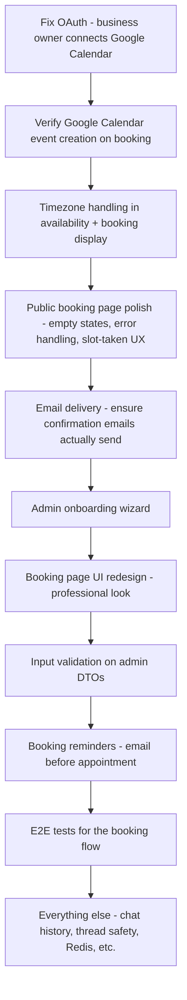

# NEXT-STEPS.md Review — Reframed for the Business Goal

> **Business goal**: Allow businesses to let users seamlessly schedule themselves on the calendar.

## TL;DR — The Current NEXT-STEPS.md Is Mostly Wrong for This Goal

The existing [NEXT-STEPS.md](../NEXT-STEPS.md) was written from a **developer/portfolio perspective** — "fix OAuth, replace demo mode, add conversation history." But the actual product goal is a **B2B scheduling platform** (think Calendly/Cal.com), and the codebase already has most of the booking platform built (all 4 phases in [plans/TODO.md](./TODO.md) are marked complete). The next steps should be about **making the existing booking flow production-ready and polished**, not about perfecting the AI chat or personal calendar features.

---

## What I Agree With in NEXT-STEPS.md

| Item | Verdict | Why |
|------|---------|-----|
| **1.1 Fix Google OAuth** | ✅ Agree — but reframe | OAuth is needed so the business owner can connect their Google Calendar. Without it, the `AvailabilityService` can't check Google Calendar busy times, so slot calculation falls back to DB-only bookings. This is a **business-owner setup blocker**, not a general auth issue. |
| **3.2 Input Validation on DTOs** | ✅ Agree | The `CreateBookingRequest` in `PublicBookingController` already has some validation, but the admin DTOs are wide open. Quick win. |
| **3.4 Google API Rate Limiting** | ✅ Agree | Polly retry policies are standard practice. Low risk, moderate value. |
| **4.1 UI Redesign** | ✅ Agree in spirit | The public booking page is the product's face. It needs to look professional. But the redesign plan focuses on the dashboard/chat split view — the **booking page** should be the priority. |

## What I Disagree With

### ❌ Priority 1.2 — "Replace Demo Mode with Real Authentication"

The NEXT-STEPS.md treats this as the #2 blocker. I disagree with the framing.

**The public booking flow has no auth at all — and that's correct.** Clients visit `/book/:slug`, pick a service, pick a time, enter their name/email, done. No login required. This is exactly how Calendly, Cal.com, and Acuity work.

The "demo mode" issue only affects the **admin dashboard** (business owner managing their services/availability/bookings). For an MVP, the hardcoded `test@example.com` user in [`AdminController.GetCurrentUserAsync()`](../CalendarManager.API/Controllers/AdminController.cs:33) is fine — it lets you demo the full flow. Real multi-user auth is a **Phase 2 concern** after the core booking experience is solid.

**What to do instead**: Keep demo mode for now. Focus on making the booking flow flawless.

### ❌ Priority 2.1 — "Conversation History Persistence"

This is about the AI chat feature ([`ClaudeService`](../CalendarManager.API/Services/Implementations/ClaudeService.cs), [`chat-panel.ts`](../calendar-manager-ui/src/app/components/dashboard/chat/chat-panel.ts)). The AI chat is a **nice-to-have admin tool** — it lets the business owner manage their calendar via natural language. It is NOT the core product.

The core product is: **client visits booking page → picks service → picks time → books**. No AI involved.

**What to do instead**: Deprioritize entirely. The chat works for single-turn requests already. Multi-turn history is polish.

### ❌ Priority 2.2 — "Thread Safety in ClaudeService"

This is an engineering concern about [`ClaudeService._currentUserId`](../CalendarManager.API/Services/Implementations/ClaudeService.cs) being an instance field. The service is registered as scoped (one per request), so this is a non-issue in practice. Even if it weren't, it only affects the AI chat — not the booking flow.

**What to do instead**: Skip. Add a code comment noting the scoped lifetime assumption and move on.

### ❌ Priority 3.1 — "Distributed Session Storage (Redis)"

PKCE verifiers in a `ConcurrentDictionary` only matter for the OAuth flow, which only the business owner uses once during setup. This is a scaling concern for a product that doesn't have users yet.

**What to do instead**: Skip until you actually need multi-instance deployment.

---

## What's Missing from NEXT-STEPS.md

These are the things that actually matter for "businesses allowing users to seamlessly schedule themselves":

### 🔴 Missing: Public Booking Page Polish

The [`BookingPageComponent`](../calendar-manager-ui/src/app/components/booking/booking-page.ts) has the 5-step flow working, but:

- **No timezone handling** — Slots are displayed in server time. A client in a different timezone will see wrong times. The [`AvailabilityService`](../CalendarManager.API/Services/Implementations/AvailabilityService.cs) calculates slots using `DateTime` (not `DateTimeOffset`), and the frontend does `new Date(dateStr)` which converts to local time inconsistently.
- **No loading skeleton / empty states** — When no slots are available for a date, the user sees... nothing? Need a clear "No availability on this date" message.
- **No booking confirmation email actually sends** — The [`EmailService`](../CalendarManager.API/Services/Implementations/EmailService.cs) is gated by `Email:Enabled` config. If SMTP isn't configured, bookings silently skip email. The client gets no confirmation. This is a **critical gap** for a scheduling product.
- **30-day lookahead is hardcoded** — [`booking-page.ts:68`](../calendar-manager-ui/src/app/components/booking/booking-page.ts:68) generates dates for the next 30 days. This should be configurable per business.
- **No "already booked" feedback** — If two clients try to book the same slot simultaneously, the second one gets a generic error. Need a clear "This slot was just taken, please choose another" UX.

### 🔴 Missing: Google Calendar Event Creation on Booking

The [`BookingService`](../CalendarManager.API/Services/Implementations/BookingService.cs) has the plumbing to create a Google Calendar event when a booking is made (it stores `GoogleCalendarEventId` on the [`Booking`](../CalendarManager.API/Data/Entities/Booking.cs:33) entity). But this only works if the business owner has connected their Google account via OAuth. If OAuth isn't working (per NEXT-STEPS 1.1), bookings are created in the DB but **don't appear on the business owner's Google Calendar**. This is a major gap — the whole point is that bookings show up on their calendar.

### 🟡 Missing: Booking Page SEO / Shareability

The booking page at `/book/:slug` is an Angular SPA route. It has:
- No `<title>` tag with the business name
- No Open Graph meta tags for link previews
- No server-side rendering

When a business shares their booking link on social media or in an email, it shows a generic preview. This matters for adoption.

### 🟡 Missing: Admin Onboarding Flow

The business owner needs to:
1. Sign up (OAuth)
2. Create their business profile (name, slug)
3. Add services (haircut, consultation, etc.)
4. Set availability (weekly hours)
5. Share their booking link

Steps 2-5 exist as separate admin pages, but there's no **guided onboarding wizard** that walks them through it. A first-time user landing on `/admin/dashboard` with no business profile would be confused.

### 🟡 Missing: Booking Reminders

No reminder emails before appointments. This is table-stakes for scheduling software — reduces no-shows significantly.

---

## Revised Priority Order

### Detailed Breakdown

| # | Task | Why It Matters |
|---|------|---------------|
| 1 | **Fix OAuth so business owner can connect Google Calendar** | Without this, bookings don't appear on the owner's calendar and availability doesn't account for their existing events |
| 2 | **Verify end-to-end: booking creates Google Calendar event** | The core value prop — client books, it shows up on the business calendar |
| 3 | **Timezone handling** | Clients in different timezones see wrong slot times. This breaks the product for any non-local business |
| 4 | **Public booking page polish** | Empty states, slot-taken errors, loading states. Make the happy path AND error paths smooth |
| 5 | **Email delivery** | Clients need booking confirmations. Business owners need new-booking notifications. Configure a default email provider or add a fallback |
| 6 | **Admin onboarding wizard** | First-time business owner needs to be guided through setup. Without this, they'll bounce |
| 7 | **Booking page UI redesign** | The booking page is the product. It needs to look trustworthy and professional |
| 8 | **Input validation on admin DTOs** | Security hygiene. Quick win |
| 9 | **Booking reminders** | Reduce no-shows. Standard feature for scheduling tools |
| 10 | **E2E tests for booking flow** | The booking flow is the critical path. Test it end-to-end |
| 11 | **Everything else** | Chat history, thread safety, Redis, recurring events, multi-calendar — all lower priority |

---

## Summary

The current NEXT-STEPS.md is oriented around **making the app technically complete** (fix auth, add chat history, thread safety). But the business goal is **seamless self-scheduling for clients**. The booking platform is already 80% built — the remaining 20% is about **polish, reliability, and trust signals** (timezone correctness, email confirmations, professional UI, guided setup). That's where the effort should go.
