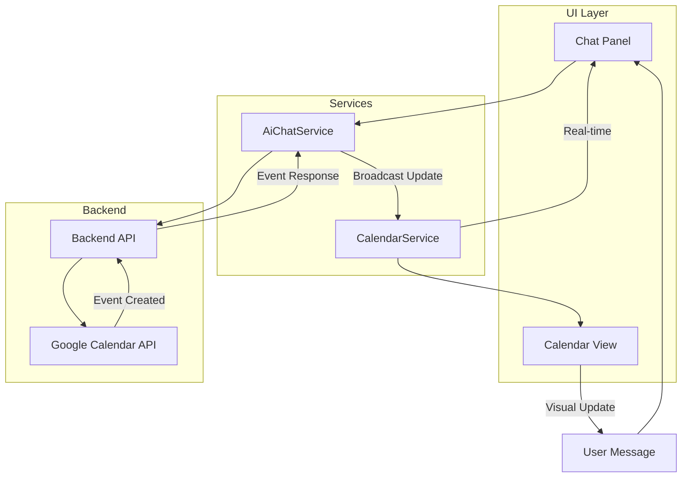
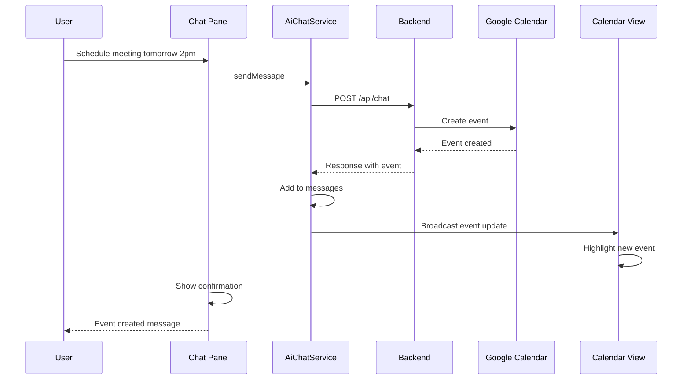

# UI Redesign: Chat-Focused Interface with Real-Time Calendar

## Current State Analysis

### Existing Layout
- Single-column card-based layout
- Chat and calendar are hidden by default (toggle buttons)
- Calendar shows only a list view of events
- No visual calendar grid
- Chat is secondary, not the primary interface

### Current Components
| Component | Location | Purpose |
|-----------|----------|---------|
| Status Card | Always visible | Shows auth status |
| Actions Card | Always visible | Toggle buttons for chat/calendar |
| Chat Card | Toggle visibility | AI chat interface |
| Calendar Card | Toggle visibility | List of events |
| Coming Soon | Always visible | Feature roadmap |

## Proposed Redesign

### New Layout: Split-Screen with Chat Focus

```
┌─────────────────────────────────────────────────────────────────────┐
│ Header: AI Calendar Manager                    [User] [Logout]      │
├─────────────────────────────────────────┬───────────────────────────┤
│                                         │                           │
│         CHAT PANEL                      │    CALENDAR PANEL         │
│         (Primary - 60%)                 │    (Secondary - 40%)      │
│                                         │                           │
│  ┌─────────────────────────────────┐   │   ┌─────────────────────┐ │
│  │ 🤖 AI: How can I help you       │   │   │  ◀  February 2026 ▶ │ │
│  │    manage your calendar?        │   │   │  Su Mo Tu We Th Fr Sa│ │
│  └─────────────────────────────────┘   │   │   1  2  3  4  5  6  │ │
│                                         │   │   7  8  9 10 11 12  │ │
│  ┌─────────────────────────────────┐   │   │  13 14 15 16 17 18  │ │
│  │ 👤 You: Schedule a meeting      │   │   │  19 20 21 22 23 24  │ │
│  │    with John tomorrow at 2pm    │   │   │  25 26 27 28        │ │
│  └─────────────────────────────────┘   │   └─────────────────────┘ │
│                                         │                           │
│  ┌─────────────────────────────────┐   │   Today's Events:         │
│  │ 🤖 AI: I've scheduled "Meeting  │   │   ┌───────────────────┐  │
│  │    with John" for tomorrow      │   │   │ 10:00 Team Standup│  │
│  │    at 2:00 PM. See it on the    │   │   │ 14:00 John Meeting│  │
│  │    calendar →                   │   │   │ 16:00 Code Review │  │
│  └─────────────────────────────────┘   │   └───────────────────┘  │
│                                         │                           │
│  ┌─────────────────────────────────────┐│                           │
│  │ Type a message...            [Send] ││                           │
│  └─────────────────────────────────────┘│                           │
└─────────────────────────────────────────┴───────────────────────────┘
```

### Key Changes

1. **Chat is Always Visible** - No toggle needed, it's the primary interface
2. **Calendar Always Visible** - Shows visual grid alongside chat
3. **Real-Time Updates** - Calendar updates immediately when AI makes changes
4. **Event Highlighting** - New/modified events flash or highlight
5. **Responsive Design** - Stacks vertically on mobile

## Architecture

### Component Structure

```
calendar-manager-ui/src/app/components/dashboard/
├── dashboard.ts              # Main container (modified)
├── dashboard.html            # Split layout (modified)
├── dashboard.scss            # Styles (modified)
├── chat/
│   ├── chat-panel.ts         # Chat component (new)
│   ├── chat-panel.html       # Chat template (new)
│   └── chat-panel.scss       # Chat styles (new)
└── calendar/
    ├── calendar-view.ts      # Calendar grid component (new)
    ├── calendar-view.html    # Calendar template (new)
    └── calendar-view.scss    # Calendar styles (new)
```

### Data Flow



## Implementation Plan

### Phase 1: Create Calendar View Component

#### Step 1.1: Calendar Grid Component
Create a visual month-view calendar with:
- Month navigation (previous/next)
- Day cells showing event indicators
- Click on day to see events
- Highlight today

#### Step 1.2: Event Indicators
- Show dots or count for days with events
- Color-code by event type/status
- Show event preview on hover

### Phase 2: Refactor Chat Component

#### Step 2.1: Extract Chat Panel
Move chat functionality to dedicated component:
- Message list with auto-scroll
- Input with send button
- Typing indicator
- Message timestamps

#### Step 2.2: Enhanced Message Types
Support rich message types:
- Text messages
- Event cards (showing created/updated events)
- Action confirmations
- Error messages with retry

### Phase 3: Real-Time Integration

#### Step 3.1: Event Stream
When AI creates/updates/deletes events:
1. Calendar service receives update
2. Calendar view animates the change
3. Chat shows confirmation with event preview

#### Step 3.2: Visual Feedback
- New events: Green highlight, fade in
- Updated events: Yellow highlight, pulse
- Deleted events: Red highlight, fade out

### Phase 4: Responsive Design

#### Step 4.1: Desktop Layout
- 60% chat, 40% calendar
- Side-by-side panels

#### Step 4.2: Tablet Layout
- 50/50 split or tabbed view

#### Step 4.3: Mobile Layout
- Full-width chat (default)
- Swipe or tab to see calendar
- Floating action button to toggle

## Detailed Component Specifications

### Calendar View Component

```typescript
// calendar-view.ts (conceptual)
@Component({
  selector: 'app-calendar-view',
  standalone: true,
  imports: [CommonModule],
  templateUrl: './calendar-view.html',
  styleUrl: './calendar-view.scss'
})
export class CalendarViewComponent implements OnInit {
  @Input() events: CalendarEvent[] = [];
  @Output() daySelected = new EventEmitter<Date>();
  @Output() eventSelected = new EventEmitter<CalendarEvent>();
  
  currentMonth: Date = new Date();
  calendarDays: CalendarDay[] = [];
  highlightedEventId: string | null = null;
  
  // Generate calendar grid for current month
  // Handle month navigation
  // Highlight new/updated events
}
```

### Chat Panel Component

```typescript
// chat-panel.ts (conceptual)
@Component({
  selector: 'app-chat-panel',
  standalone: true,
  imports: [CommonModule, FormsModule],
  templateUrl: './chat-panel.html',
  styleUrl: './chat-panel.scss'
})
export class ChatPanelComponent {
  messages$: Observable<ChatMessage[]>;
  processing$: Observable<boolean>;
  inputMessage: string = '';
  
  // Send message
  // Auto-scroll to bottom
  // Handle rich message rendering
}
```

## Visual Design Specifications

### Color Palette

| Element | Color | Usage |
|---------|-------|-------|
| Primary | #667eea | Headers, buttons |
| Secondary | #764ba2 | Accents, gradients |
| Chat Background | #f8f9fa | Chat panel |
| Calendar Background | #ffffff | Calendar panel |
| New Event | #28a745 | Green highlight |
| Updated Event | #ffc107 | Yellow highlight |
| Deleted Event | #dc3545 | Red highlight |
| Today | #667eea | Current day marker |

### Typography

| Element | Size | Weight |
|---------|------|--------|
| Chat messages | 14px | 400 |
| Event titles | 13px | 600 |
| Calendar day numbers | 12px | 500 |
| Headers | 18px | 600 |

### Animations

```scss
// Event highlight animation
@keyframes eventHighlight {
  0% { background-color: rgba(40, 167, 69, 0.3); }
  50% { background-color: rgba(40, 167, 69, 0.5); }
  100% { background-color: transparent; }
}

.event-new {
  animation: eventHighlight 2s ease-out;
}

// Message slide-in
@keyframes messageSlide {
  from { 
    opacity: 0;
    transform: translateY(10px);
  }
  to {
    opacity: 1;
    transform: translateY(0);
  }
}

.message {
  animation: messageSlide 0.3s ease-out;
}
```

## Real-Time Update Flow



## Files to Modify/Create

### New Files
1. `calendar-manager-ui/src/app/components/dashboard/chat/chat-panel.ts`
2. `calendar-manager-ui/src/app/components/dashboard/chat/chat-panel.html`
3. `calendar-manager-ui/src/app/components/dashboard/chat/chat-panel.scss`
4. `calendar-manager-ui/src/app/components/dashboard/calendar/calendar-view.ts`
5. `calendar-manager-ui/src/app/components/dashboard/calendar/calendar-view.html`
6. `calendar-manager-ui/src/app/components/dashboard/calendar/calendar-view.scss`

### Modified Files
1. `calendar-manager-ui/src/app/components/dashboard/dashboard.ts` - Import new components, update logic
2. `calendar-manager-ui/src/app/components/dashboard/dashboard.html` - New split layout
3. `calendar-manager-ui/src/app/components/dashboard/dashboard.scss` - New styles
4. `calendar-manager-ui/src/app/services/calendar.service.ts` - Add real-time update methods
5. `calendar-manager-ui/src/app/services/ai-chat.service.ts` - Add event broadcast

## Acceptance Criteria

### Chat Panel
- [ ] Chat is always visible on desktop
- [ ] Messages auto-scroll to bottom
- [ ] Shows typing indicator while AI processes
- [ ] Supports rich message types (event cards)
- [ ] Enter key sends message
- [ ] Disabled state while processing

### Calendar View
- [ ] Shows current month by default
- [ ] Navigate to previous/next months
- [ ] Today is highlighted
- [ ] Days with events show indicators
- [ ] Click day shows events for that day
- [ ] New events animate in with highlight
- [ ] Updated events pulse briefly

### Real-Time Integration
- [ ] Calendar updates immediately when AI creates event
- [ ] Chat shows event preview card
- [ ] Visual feedback for all calendar changes
- [ ] No page refresh needed

### Responsive
- [ ] Desktop: Side-by-side layout
- [ ] Tablet: Stacked or tabbed
- [ ] Mobile: Full-width chat, swipe to calendar

## Next Steps

1. **Switch to Code mode** to implement the calendar view component
2. **Create the chat panel component** with enhanced features
3. **Update the dashboard** to use the new split layout
4. **Add real-time updates** via service communication
5. **Test responsive behavior** across device sizes
